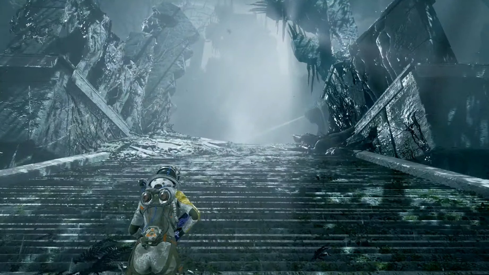
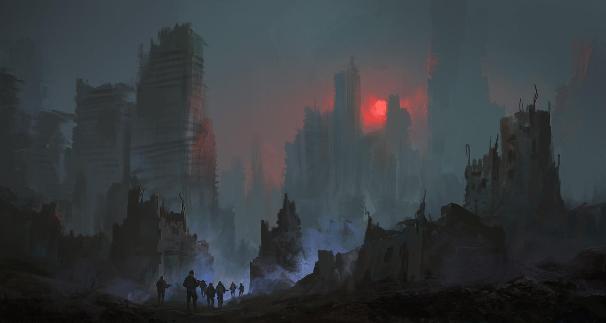
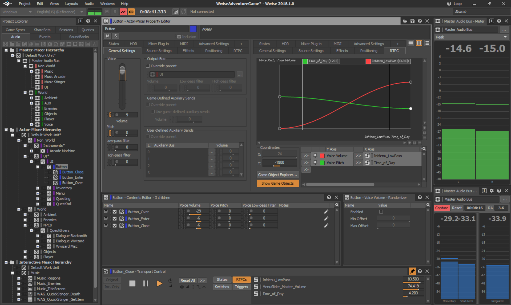

# <!-- fit --> Teaching Video Game Sound

## <!-- fit --> Balancing Technical Know-How with Sonic Creativity

  <a href="http://tatecarson.com">Tate Carson</a>  
  Assistant Professor in Digital Sound Design  
  Dakota State University 

<!-- 
43 seconds per slide! 
 -->

---

<!--
footer: 'Source: Returnal (2021) [AllGamers](https://ag.hyperxgaming.com/article/10314/returnal-is-a-freaky-new-sci-fi-action-horror-shooter)'
-->

# Introduction

- Trace the evolution of game audio education
- Discuss best practices in game audio education
- Describe DSU's course
- Share project-based learning models
- Encourage course adoption
- Show fit within a music tech program

<!-- 
- The purpose of this talk:
  - To present a history of game education and how it is beginning to form into a discipline
  - To exchange ideas and best practices for game audio education
  - To describe the course as it's taught at DSU. To showcase an innovative approach to teaching game audio
  - To share a model for an effective project-based learning and possible collaboration with a game design program
  - To inspire other institutions to adopt similar courses or components
  - To demonstrate how game audio education can fit into a music technology program
 -->

---

# <!-- fit --> Advice from the literature

<!-- footer: '' -->

---

## Curriculum Standards

- No established curriculum or standards for game audio education (Onen, Stevens, and Collins 2011; Bragança 2015; Cunningham and Smith 2015; Sarisky 2011; Hug 2007)
- Programs vary considerably between institutions 
- More work needed on dedicated programs meeting industry needs (Onen, Stevens, and Collins 2011)

<!-- 

**No established curriculum or standards**

- There is currently no established curriculum or set of standards for comprehensive game audio education programs (Onen, Stevens, and Collins 2011; Bragança 2015; Cunningham and Smith 2015; Sarisky 2011; Hug 2007). 
- Different academic institutions vary considerably in their game audio offerings, leading to gaps and inconsistencies in students' knowledge.
- More work is needed to develop dedicated programs meeting industry needs (Onen, Stevens, and Collins 2011).
 -->

---

## Gaps and inconsistencies  

- Gaps and inconsistencies in game audio education (Onen, Stevens, and Collins 2011; Bragança 2015; Cunningham and Smith 2015; Sarisky 2011)
- No formal worldwide curriculum exists (Bragança 2015) 
- Audio neglected compared to visual development (Sarisky 2011)
- No established curriculum allows iterative teaching approach (Hug 2007)

<!-- 

**Gaps and inconsistencies**

- Onen et al. (2011) argue significant gaps exist in game audio education, with few options for comprehensive knowledge.
- Bragança (2015) states no formal worldwide curriculum exists for game audio. More awareness needed to implement it successfully.
- Sarisky (2011) points out audio is often neglected compared to visual game development. 
- Hug (2007) sees it as an advantage there is no established curriculum yet, allowing an iterative teaching approach.
 -->

---

## Interdisciplinary  

  <!-- First Column -->
  

      <h3>Onen et al., 2011</h3>
      <ul style="list-style-type: disc; margin-left: 20px;">
          <li>Intersection of arts and computer science.</li>
          <li>Requires diverse academic skills.</li>
      </ul>
      <h3>Bragança, 2015</h3>
      <ul style="list-style-type: disc; margin-left: 20px;">
          <li>Interdisciplinary demands.</li>
          <li>Need for academic collaboration.</li>
      </ul>
  

  <!-- Second Column -->
  

      <h3>Interactive Audio Special Interest Group (IASIG) 2011</h3>
      <ul style="list-style-type: disc; margin-left: 20px;">
          <li>Fusion of separate disciplines.</li>
          <li>Multiple roles in the field.</li>
      </ul>
      <h3>Sarisky and Pennycook, 2009</h3>
      <ul style="list-style-type: disc; margin-left: 20px;">
          <li>Proposed interdisciplinary degree.</li>
          <li>Industry needs for diverse skills.</li>
      </ul>
  

<!-- 
Onen et al. (2011):

- Game audio creators fall between arts/humanities and computer science programs in most schools. 
- The field encompasses many academic departments while requiring specialized knowledge like programming.
- There are challenges incorporating knowledge from so many disciplines.

Game Audio Curriculum Guideline (2011):

- Notes game audio combines disciplines often separated in universities.
- Practitioners wear many hats, blurring lines between roles.  

Bragança (2015):

- Emphasizes game audio's interdisciplinary nature demands awareness of diverse topics.
- Calls for collaboration between academic departments.

Sarisky and Pennycook (2009):

- Proposed an interdisciplinary degree program.
- Addresses the diverse skill-set needed for composers and audio engineers in industry.
 -->

---

## Core principles 

- Onen, Stevens, and Collins 2011
  - Programs should teach core principles, not specific tools 
  - Game industry is driven by technological innovation  
  
<!-- 
- Programs should teach core principles, not specific tools 
  - Technology changes rapidly in game audio field  
  - Focus on adaptability and autonomous learning 
- Game industry is driven by technological innovation  
  - Software and tech can become outdated quickly
  - Students need early understanding of different areas 

 -->

---

## Soft skills

- Industry emphasizes technical skills and "soft skills" (Onen, Stevens, and Collins 2011; Bragança 2015)
- Recommend recreating industry pressures to nurture soft skills (Bragança 2015)
- Adaptability also important (Onen, Stevens, and Collins 2011) 

<!-- 

- Industry emphasizes technical skills and "soft skills" like communication and teamwork (Onen, Stevens, and Collins 2011; Bragança 2015)
  - Soft skills overlooked in academia but critical for industry (Bragança 2015)
  - Soft skills key for an industry based on collaboration (Bragança 2015)
- Recommend recreating industry pressures in class to nurture soft skills (Bragança 2015)
- Adaptability to changes in the field also important (Onen, Stevens, and Collins 2011) 

-->

---

## Curricula 

- Core Courses
  - Core courses develop skills like recording, editing, programming (Onen, Stevens, and Collins 2011; Sarisky and Pennycook 2009)
  - Common first year allows understanding other areas (Onen, Stevens, and Collins 2011) 
- Specialized tracks
  - Tracks in areas like composition, sound design, audio programming (Sarisky and Pennycook 2009)
- Curriculum should foster teamwork on collaborative projects (Onen, Stevens, and Collins 2011)

<!-- 
The literature offers suggestions for building a multi year game audio curriculum with common courses and specialized tracks. At DSU we offer core courses that are geared generally to music technology and we offer only one game audio course, but this concept is still helpful. 

#### Core Courses
- (Onen, Stevens, and Collins 2011) - Core courses build essential skills like recording and programming, and a common first year offers a broad foundation (Onen, Stevens, and Collins 2011).

#### Specialized Tracks
- (Sarisky and Pennycook 2009) - Specialized courses offer depth in areas like composition and sound design, aligning with career goals.

#### Collaboration
- (Onen, Stevens, and Collins 2011) - Curriculum emphasizes teamwork through collaborative projects, preparing students for the interdisciplinary nature of the field .
 -->

---

## Project-based learning

- Experiential, project-based learning encouraged (Onen, Stevens, and Collins 2011; Hug 2007)
- Team projects allow reflecting on roles, developing capabilities (Onen, Stevens, and Collins 2011)
- Ongoing journaling and portfolio development suggested (Onen, Stevens, and Collins 2011)

<!-- 
- Onen and Hug encourage experiential, project-based learning (Onen, Stevens, and Collins 2011; Hug 2007)
  - It develops portfolio work and collaboration skills
  - Onen recommends learning cycles with simulation, role play (Onen, Stevens, and Collins 2011)
- Onen also mentions that team projects allow reflecting on roles, developing capabilities (Onen, Stevens, and Collins 2011) 
- and ongoing journaling and portfolio development suggested (Onen, Stevens, and Collins 2011)
 -->

---

## Industry Feedback 

- (Onen, Stevens, and Collins 2011)
  - Ongoing feedback from industry and updating curricula is important as game audio practices evolve 
  - More pedagogical materials need to be developed to support teaching 

---

# <!-- fit --> DSU's Sound Design for Games 

---

# Course Structure 

- History and evolution of game sound 
- Sound design specifics for interactive games 
- Audio implementation techniques
- Group project with Game Design 

<!-- footer: <a href="https://www.freepik.com/free-photo/team-soldiers-walk-city-after-nuclear-war-illustration_14402271.htm#query=game&position=48&from_view=search&track=sph">Image by liuzishan</a> on Freepik -->

<!-- 

- My course covers 
  - the history of game sound and its evolution 
  - Aims to transform existing skills in linear media sound design and music to interactive game audio, adapting them a gaming context 
  - both the technical aspects of audio implementation and the creative aspects of sound design needed for game audio
- Includes a collaborative group project with Computer Game Design program to apply skills to a real game audio project
  - Allows students to utilize skills learned in class on a hands-on game development experience 
- Provides a well-rounded game audio education to prepare students for careers in the gaming industry
- Fits into the broader music technology curriculum as game audio is a growing field in the music industry
-->

---

# <!-- fit --> Game Audio History: References

- Game Audio Curriculum Guidelines 
  - Video Game and Game Audio History 
- Sarisky's Course
  - Introduction to the Concepts of Audio for Electronic Games

<!-- footer: '' -->

<!-- 
- The game audio curriculum guidelines suggest an entire course on game audio history: 
  - The course "Video Game and Game Audio History" provides an overview of the history of video games, focusing on the evolution of sound and music. Teaching methods include lectures, discussions, and projects, covering topics from the history of video games to the impact of technology on audio. 
- Sariksy's course implements a history module within a larger course
  - Sarisky's course, "Introduction to the Concepts of Audio for Electronic Games," focuses on sound design in gaming, covering terminology, technology, and techniques for implementing sound and music. The course explores the history of game audio, principles of sound implementation, and introduces various middleware tools like Xact, Wwise, Fmod, and Unreal. Upon completion, students will be equipped to analyze sound designs, understand the roles in an audio production team, and apply sound assets using level editing tools.

 -->

---

## Game Audio History: Weeks 1 -3 

| Week 1                                                      | Week 2                                                      | Week 3                                          |
| ----------------------------------------------------------- | ----------------------------------------------------------- | ----------------------------------------------- |
| Adaptive, reactive audio in emergent gameplay               | Innovations: sampled sound, MIDI, streaming music, 3D audio | Types of sounds, editing techniques, team roles |
| Evolution from Flash to HTML5 web games                     | Game audio history with advances in graphics and computing  | Workflow for game sound designers               |
| Link game design concepts like interactivity to audio needs | Iconic games and their innovative audio tech usage          | Audio file formats and sound libraries          |

<!-- 
## Key Takeaway:
- Lectures cover evolution, innovations, and workflows in game audio history.
 -->

---

## Exercise 1: Untitled Cat Game
- Source or create audio files based on specifications in an assets list 
- Follows lessons on workflows, asset lists, and editing techniques.

## Exercise 2: Horror UI Sound Effects in Reaper
- Linear sound design project to get students comfortable with creating assets for a game 
- Edit sounds to match visuals, use advanced editing techniques.

<!-- 
## Key Takeaway:
- Exercises provide hands-on practice and reinforce lecture concepts, such as sourcing assets, sound editing, and audio's role in gameplay.

 -->

<!-- footer: "Exercises adapted from [APU Games](https://github.com/APUGames/)" -->

---

# Voice Over: References 

- **Multifaceted Roles**: Composers often handle multiple tasks like sound effects and voice-overs in addition to music (Onen, Stevens, Collins, 2011).
  - **Skill Set**: Beyond traditional media skills, game audio professionals need expertise in interactive, non-linear media.
- **Voice and Dialog Specialization**: Roles include Dialog Event Designer, VO Actors, and VO Director, among others (Interactive Audio Special Interest Group (IASIG) 2011).
  - **Education Path**: Students interested in specialization in voice/dialog should take a sound design track and relevant electives.

<!-- 
## Multifaceted Roles in Game Audio
- According to Onen, Stevens, and Collins (2011), composers in the game audio sector often have to multitask. They don't just compose music; they are also responsible for recording and editing sound effects, sound design, and even dialog and voice-overs.
- This highlights the need for a diversified skill set, which goes beyond what's required for traditional linear media like films. Composers need to be equipped to handle the interactivity and non-linearities specific to gaming.

## Specialization in Voice and Dialog
- The "Game Audio Curriculum Guideline" from 2011 provides a detailed breakdown of specialized roles within voice and dialog in game audio. This includes roles like Dialog Event Designer, Character Profiler, VO Actors, and VO Director.
- Each role comes with its own set of responsibilities, such as defining speech systems or directing voice-over performances. The guideline recommends that students who are interested in this area should focus on a sound design track and take electives in voice, theatre, and communication.

## Career Options in Voice-Over
- The curriculum guideline also suggests that students have the option to specialize in voice-over roles after completing a semester-long sound design course. 
-->

<!-- footer: '' -->

---

# Voice Over: Week 4 

 

  

    <h3>Key Points on Voice-Overs</h3>
    <ul style="margin-bottom: 10px;">
      <li><strong>Importance</strong>: Human voice enhances game immersion.</li>
      <li><strong>Evolution</strong>: From synthesis to recorded dialogue.</li>
      <li><strong>Functions</strong>: Diegetic and non-diegetic roles.</li>
      <li><strong>Roles</strong>: Involves producer, writer, and actors.</li>
    </ul>
  

  

    <h3>Exercise 3: Voice Over</h3>
    <ul style="margin-bottom: 10px;">
      <li><strong>Recording</strong>: Capture high-quality vocals.</li>
      <li><strong>Talent</strong>: Get a good performance.</li>
      <li><strong>Editing assets</strong>: Prepare individual sound files.</li>
    </ul>
  

  

<!-- 
### Key Points on Voice-Overs
- I explain teh importance of VO to games. The human voice enhances game immersion through cues, storytelling, and character interaction.
- Progress from early voice synthesis to recorded dialogue. 
- Explain both diegetic and non-diegetic roles of VO; prevalent in story-driven games.
- **Production Roles**: Involves multiple roles such as producer, writer, voice actor, and engineers.
  
### Exercise 3: Voice Over
- **Recording Engineer**: Responsibility for high-quality recordings, reflecting lesson on studio setup.
- **Voice Talent & Directing**: Aligns with lesson content on role of voice actors and directors.
- **Editing**: Task of preparing individual sound files, connecting to the role of the editing engineer.
- **Asset Management**: Updating the asset spreadsheet relates to localization and programming.

-->

<!-- footer: "" -->

---

# Practical sound design 

## Project 1: Game scene sound design

- **Objective**: Redesign sound for a 30-second game cutscene.
- **Focus**: Layered sound effects, no background music.
- **Techniques**: Use class-taught sound design methods: layering, pitch shifting, effects etc. 
- **Narrative**: Shape emotional experience through sound variation.

<!-- 

- **Project Objective**: The main aim of this project is to take a 30-second cutscene or trailer from a game of your choice and redesign its sound to make the experience more immersive.
- **Content Focus**: Unlike typical sound design projects that may include background music, this project specifically asks you to focus solely on the sound effects that accompany on-screen actions. 
- **Sound Design Techniques**: Students apply various sound design techniques that we've covered in class. This includes everything from pitch modulation to volume adjustments and even applying specific filters to make each sound effect unique and multilayered.
- **Narrative Flow**: One of the unique aspects of this project is the requirement to think narratively. Students plan how your sound effects can introduce rises, falls, and impactful moments that amplify the emotional experience of the scene.
 -->

<!-- footer: "" -->

---

# <!-- fit --> Interactive Music Composition: References

- **Practical Focus**: Hands-on skills in courses like "Interactive Music Composition 1".
- **Balanced Curriculum**: Blend of music theory and specialized electro-acoustic courses (Sarisky & Pennycook, 2009).
- **Theoretical Inclusion**: Importance of 'Game Music Analysis' (Onen, Stevens, & Collins, 2011).
- **Skill Prioritization**: Music analysis less crucial for sound designers compared to composers (Onen, Stevens, & Collins, 2011).

<!-- 

- **Practical Focus**: The "Interactive Music Composition 1" course, from the game audio curriculum guideline, is an example of applied approaches in game audio education. It equips students with the skills needed for entry-level positions in game development or freelance game music professions, covering everything from workflow and contracts to hands-on experience in advanced composition techniques .
- **Balanced Curriculum**: According to Sarisky and Pennycook (2009), a well-rounded game audio curriculum should marry traditional music theory and history courses with specialized electro-acoustic and computer music composition courses, all aimed at meeting the unique demands of the game audio industry.
- **Theoretical Inclusion**: Onen, Stevens, and Collins (2011) argue for the inclusion of theoretical components like 'Game Music Analysis.' These would provide students with a deeper understanding of the aesthetics, practices, and technological advances in interactive music.
- **Skill Prioritization**: They also note that while music analysis skills are important, they are considered less crucial for roles like sound designers and programmers compared to composers.

 -->

<!-- footer: "" -->

---

## Week 6: Interactive Music Composition 

<!-- Column 1 -->

  <h3>Key Points</h3>
  <ul style="list-style-type: disc; margin-top: 10px;">
    <li><strong>Not a Composition Class:</strong> Focus on adaptive techniques: Vertical remixing, horizontal sequencing.</li>
    <li><strong>Music Team Roles:</strong> Director, producer, composer, engineers.</li>
    <li><strong>Music's Role:</strong> Sets mood, establishes setting, adapts to gameplay.</li>
  </ul>

<!-- Column 2 -->

  <h3 >Exercise 4: Music Exporting</h3>
  <ul style="list-style-type: disc; margin-top: 10px;">
    <li><strong>Objective:</strong> Hands-on with exporting music assets.</li>
    <li><strong>Tools Used:</strong> Reaper's export capabilities.</li>
    <li><strong>Techniques Applied:</strong> Vertical re-orchestration, linear cues.</li>
    <li><strong>Workflow Skills:</strong> Batch exporting, naming conventions.</li>
    <li><strong>Real-World Application:</strong> Skills for assembling interactive scores.</li>
  </ul>

<!-- 
- **Module Description**: Though this class doesn't focus on composing music, it's important for students to understand how adaptive techniques like layering and sequencing are used to create interactive game soundtracks. This involves a collaborative effort from the music team, from composition to final integration.
- **Week 6 Summary**: Early game music was constrained by technology, but has now evolved to include complex adaptive techniques like vertical remixing and horizontal sequencing to adapt the music based on player actions. The music team involves various roles, from the director and producer to engineers who finalize the tracks.
- **Exercise 4**: This exercise gives students hands-on experience with the complex process of exporting music assets for games. It teaches them to use Reaper's (a digital audio workstation) powerful export capabilities to generate stems that can be integrated into game audio middleware. This process includes techniques like vertical re-orchestration, linear cinematic cues, and batch exporting, among others.
- **Real-World Skills**: The exercise is designed to impart real-world skills needed to deliver production-ready music assets for a hypothetical game project, including understanding the need for documentation and technical export tasks.

-->

---

# <!-- fit --> Audio Implementation: References    

- **Focused Learning**: Cunningham and Smith (2015) streamlined modules to create a more focused course on game audio technologies and implementation techniques.
- **Comprehensive Coverage**: Sarisky (2011) suggests adding two courses for a well-rounded curriculum, covering both interactive audio and historical aspects of game audio.
- **Versatility in Roles**: Interactive Audio Special Interest Group (IASIG) (2011) emphasizes the need for multi-disciplinary skills, especially in smaller settings, including programming-like logic for audio implementation.

<!-- 
- **Curriculum Revisions for Focused Learning**: Cunningham and Smith (2015) discuss a revision in their game audio curriculum that consolidated two modules into a single, more focused module. This new module, "Audio Technology for Games," integrates digital audio fundamentals and editing processes with implementation techniques for modern game engines. 

- **Course Additions for Comprehensive Coverage**: Sarisky (2011) proposes the addition of two new courses to the existing curriculum. The first course would cover interactive audio implementation and mixing, while the second focuses on the historical, artistic, and platform-specific aspects of electronic game audio. These courses aim to provide a well-rounded understanding of game audio.

- **Jack-of-All-Trades in Audio**: The "Game Audio Curriculum Guideline" (2011) notes that game audio practitioners, especially in smaller or lower-budget settings, often need to be multi-disciplinary. They may have to compose, manage sound design, and even implement the audio, requiring a broader skill set that includes some programming knowledge. This reflects the industry's need for versatile professionals who can navigate the complexities of game audio implementation.

 -->

<!-- footer: "" -->

---

# Weeks 7 - 12: Audio Implementation and Wwise 

- **Middleware Choices**: Wwise or FMOD
- **Initial Setup**: Unity and Wwise Integration
- **Advanced Techniques**: Sound Positioning & Triggering

<!-- 
- **Middleware Choices**: We use Audiokinetic Wwise as our middleware, but FMOD is another popular choice. The depth of audio implementation covered in class should depend on students' technical ability and interest.
- **Initial Setup**: Week 7 focuses on setting up Unity and Wwise for game audio. It covers the installation process, interface exploration, and a foundational project that involves simple spatial audio techniques.
- **Advanced Techniques**: As we progress through weeks 11-12, we introduce more complex topics like sound positioning, triggering sounds through player actions, and creating a footstep system using random containers and switches.
 -->

<!-- footer: 'source: [Blog | Audiokinetic](https://blog.audiokinetic.com/en/wwise-2018.1/)' -->

---

# Project 2: Unity and Wwise Integration 

- **Objective**: Equip students with ability to complete Wwise-Unity integration and implement spatial audio.
  - **Unity Steps**: Create 3D project, add cube, and set up AkGameObj component.
  - **Wwise Setup**: Import loop sound, create Event, enable 3D positioning.
- **Integration**: Link Wwise to Unity, add Event to cube, and spatialize sound via C# script.
- **Learning Goals**: Master AkGameObj setup, sound import, Event triggering, and basic 3D audio.

<!-- 

- **Objective**: The aim of this project is to equip students with the technical know-how to integrate Wwise with Unity, focusing specifically on spatial audio.  
  - **Unity Steps**: Students will start by creating a new 3D Unity project and adding a cube game object, which will be enhanced for Wwise integration through the AkGameObj component.
  - **Wwise Configuration**: In Wwise, students will create a new project and import a looping sound effect. They will then set up an Event to trigger this sound and enable its 3D positioning.
- **Integration**: The next step is to link the Wwise project with Unity, add the Wwise Event to the cube to play the sound, and use a custom C# script to move the cube in space over time, thereby spatializing the sound.
- **Learning Outcomes**: By the end of this project, students will have a foundational understanding of how to set up an AkGameObj, import sounds into Wwise, create and trigger Positioned Events, and understand the basics of 3D sound positioning.
- **Takeaway**: This project serves as an introduction to the fundamentals of spatialized audio, providing students with a solid foundation without overwhelming them with advanced features.

-->

<!-- footer: "" -->

---

# <!-- fit -->  Final Project Description 

- **Roles**: Sound Designer, Audio Implementer, Composer
- **Game Choice**: Game Design Class, Open-source, Unity Demos
- **Proposal**: Serves as Grading Rubric
- **Class**: Last 3-4 weeks open lab

<!-- 
### Final Project Speaker Notes

- **Team Structure**: Students form teams of 3-4, each with distinct roles such as Sound Designer, Audio Implementer, and sometimes Composer.
- **Game Selection**: Choices include games from the game design class, open-source games, or built-in Unity demos.
- **Proposal**: About a month before semester's end, teams submit a proposal detailing the game they'll work on and an assets list. This proposal acts as the project's grading rubric.
- **Class Format**: The final 3-4 weeks are open lab sessions. No lectures, but mandatory attendance for hands-on work and troubleshooting.

 -->

---

# <!-- fit --> Final Project Challenges

- **Overview**: challenges from group dynamics to technical difficulties, that need to be addressed for successful completion.
- **Group Issues**: Independent work can lead to unequal participation, unclear roles, and varying commitment levels. 
- **Time Constraints**: Students often feel the pinch of time, both for mastering Wwise and C# basics and for delivering a polished, sound-rich game.
- **Game Selection**: Finding the right game for students to work on is tricky.
- **Debugging Difficulties**: With students working on different games, it becomes a complicated task for the professor to troubleshoot and debug each project, given the unfamiliarity with the individual games.

<!-- 
### Final Project Challenges

- **Overview**: The final project presents several challenges, from group dynamics to technical difficulties, that need to be addressed for successful completion.
- **Group Issues**: Independent work can lead to unequal participation, unclear roles, and varying commitment levels. Time management and quality can suffer as a result.
- **Time Constraints**: Students often feel the pinch of time, both for mastering Wwise and C# basics and for delivering a polished, sound-rich game.
- **Game Selection**: Finding the right game for students to work on is tricky. Games from the game design class can have architectural and bug issues, while finding suitable games online is time-consuming and has a low success rate.
- **Debugging Difficulties**: With students working on different games, it becomes a complicated task for the professor to troubleshoot and debug each project, given the unfamiliarity with the individual games.
 -->

<!-- footer: "" -->

---

# <!-- fit --> Possible curriculum updates

- Reduce time on game audio history
- Focus more on game music composition
- Streamline audio implementation setup
- Refine final project guidelines

<!-- 
### Speaker Notes

- I've found that spending three weeks on the history of game audio is excessive and takes away from practical application. In future iterations, I'll cut this down to allocate more time for composing and implementing game music.
- Another area I intend to improve is the audio implementation setup. I've noticed that many students face roadblocks here, mostly due to unclear instructions for installing the necessary software. To address this, I plan to provide more explicit and simplified guidelines to ensure that we spend more time learning about game audio implementation and less time troubleshooting.
- Finally, I'm looking to make the final project more effective as a learning experience. I aim to make the project description less open-ended and provide a curated list of games for sound implementation. This will help students focus on delivering higher quality work.
 -->

<!-- footer: "" -->

---

# Course Adoption?  

 <!-- Container -->
  

  <!-- First Column -->
  

    <ul style="padding-left: 20px;">
      <li><strong>Curriculum enrichment</strong>
        <ul style="list-style: none;">
          <li>Expands curriculum & skills</li>
          <li>Career prep in gaming</li>
          <li>Interdisciplinary learning</li>
        </ul>
      </li>
    </ol>
  

  <!-- Second Column -->
  

    <ul start="2" style="padding-left: 20px;">
      <li><strong>Universal techniques</strong>
        <ul style="list-style: none;">
          <li>Layering, Sound Palettes</li>
          <li>Narrative Flow, Documentation</li>
        </ul>
      </li>
    </ol>
  

 <!-- End of Container -->

## Other Applications
 
 <!-- Container -->
  

  <!-- First Column -->
  

    <ul style="list-style: none; padding: 0;">
      <li><strong>Film & TV:</strong> Dynamic Mixing, Spatial Audio</li>
      <li><strong>Podcasting:</strong> Interactive Storytelling, Layering</li>
      <li><strong>Music:</strong> Algorithmic Composition, Virtual Concerts</li>
      <li><strong>Advertising:</strong> Adaptive Sound</li>
    </ul>
  

  <!-- Second Column -->
  

    <ul style="list-style: none; padding: 0;">
      <li><strong>VR/AR:</strong> Spatial Audio</li>
      <li><strong>Theater:</strong> Real-Time Sound Design</li>
      <li><strong>Museums:</strong> Interactive Installations</li>
      <li><strong>Automotive:</strong> In-Car Entertainment</li>
    </ul>
  

  
 <!-- End of Container -->

<!-- 

### Speaker Notes

1. **Why Adopt the Course:**
    - Adopting a game audio course enriches the music tech curriculum by integrating both creative and technical skills. It offers students new career pathways in the burgeoning gaming industry and fosters interdisciplinary learning through potential collaborations with game design programs.

2. **Key Techniques in Game Audio:**
    - The course teaches universally applicable audio production techniques. These include layering sounds for complexity, creating sound palettes for cohesiveness, and understanding narrative flow for effective storytelling across various media like film and podcasts.

3. **Applications Beyond Games:**
   - By adding this course, we not only diversify our curriculum but also prepare students for a wide range of audio-related careers.
 
-->

---

## References

    Bragança, Ricardo. 2015. “Modding Game Audio for Education.” Journal of The Audio Engineering Society, May.

    Brown, Andrew R. 2016. “Game Technology in the Music Classroom: A Platform for the Design of Music and Sound,” January, 122–33.

    Cunningham, Stuart, and Richard J. L Smith. 2015. “Interdisciplinary Experiences of Teaching Audio for Games.” In Proceedings of the 26th AES Conference: Audio Education.

    Donnelly, Cormac. 2015. “A Proposal for Specific Industry Accreditation for Game Audio Education.” In Proceedings of the 26th AES Conference: Audio Education.

    Interactive Audio Special Interest Group (IASIG). 2011. “Game Audio Curriculum Guideline.”

---

## References

    Hamilton, Robert. 2015. “Designing Next-Gen Academic Curricula for Game-Centric Procedural Audio and Music.” In Audio Engineering Society Conference: 56th International Conference: Audio for Games.

    Hug, Daniel. 2007. “Game Sound Education at the Interaction Design Department of the Zurich University of the Arts - Between Research Laboratory and Experimental Education.” In Proceedings of the 2nd Audio Mostly International Conference. Germany.

    Lankford, Elsa. 2020. “Breaking the Sound Barrier: The Importance of Interdisciplinary Audio Curricula.” In Audio Education: Theory, Culture, and Practice. New York: Routledge.

    Onen, U., Richard Stevens, and K. Collins. 2011. “Designing an International Curriculum Guideline for Game Audio: Problems and Solutions.” Journal of Game Design and Development Education 1 (January): 38–47.

---

## References

    Sarisky, Mark J. 2011. “Integrating ‘Audio for Games’ Into the Modern Audio Production Curriculum.” In Audio Engineering Society Conference: 41st International Conference: Audio for Games.

    Sarisky, Mark, and Bruce Pennycook. 2009. “A Curriculum for a Degree in Audio Design for Game Development.” In Proceedings of the 35th AES Conference. London, UK.

    Summers, Chanel. 2015. “Teaching the Aesthetics of Game Audio Design.” Presented at the Game Development Conference. https://gdcvault.com/play/1022281/Teaching-the-Aesthetics-of-Game.

    Wang, Richert, and Vincent Olivieri. 2018. “Sound Design for Video Games: An Interdisciplinary Course for Computer Science and Art Students.” Technical Symposium on Computer Science Education, February, 981–86. https://doi.org/10.1145/3159450.3159577.

---

# <!-- fit --> Questions? 